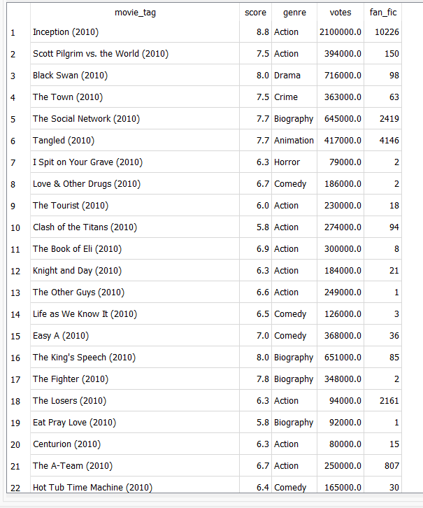

# MovieTrends
## Final Project

#### Members:

Kyla Ward,

Courtney Hayes,

Shawn Kitagawa,

Alekzander Holmes

##### Communication protocol for Group
Primary communication through the group project slack channel as well as updating our group GitHub respository branch promptly.
Zoom group sessions can be planned when schedules allow typically weekends after 8pm. Group will update and keep communication on scheduling open through the primary 
slack channel. Discuss everyones game plan during class for upcoming tasks

### Project Overview
For this final project we have chosen to use the skills learned in scraping websites, cleaning data, creating ERD and databases to present a cohesive 
story with visualizations. The data we will be working with is a list of movies released filtered from 2010-2016 from the website IMDB with their movie rating and 
comparing to a fan fiction site AO3. This website collects tags for each movie name when there is a story added pertaining to the movie title. We will be trying to 
determine if there is a correlation between popular movies releases and the number of fan fiction stories tagged. The 2 sites we have used are IMDB and A03 a popular 
fan fiction site. We will be determining a movies popularity based on the IMDB score, and the number of fan fictions written about each movie title.

#### Data Overview
Using Tableau to create initial visualizations. Once more analysis can be done by the machine learning model the visualizations will be updated accordingly

##### Database
Using SQLite a merged and cleaned dataset created

#### Presentation
Outline of our process with visualizations, each group member can explain which parts they contributed.
1.	After project was set we gathered the necessary data by scraping A03 with splinter and chrome browser and then designed our schema outline
2.	Preparing and cleaning data. We also used various python libraries, using pandas is important to manipulate the data. We learned a new one LangDetect that helped 
    our process greatly. Then both set of data were merged as final complete and clean dataset.
3.	Database was created using SQLite and we made a primary key to be the movie tag used on A03 to be able to merge our data with an inner join.       
4.	Machine learning model process linear regression model, when we started this hypothesis was that the movie score would have more and results
5.	Visualization breakdown 
6.	Our ultimate discovery of the model and visualizations we were able to create.
7.	Describe ideas for how you can further refine adjust and improve the model for future analysis.  

#### Conclusion
Future analysis and what can be done to improve

